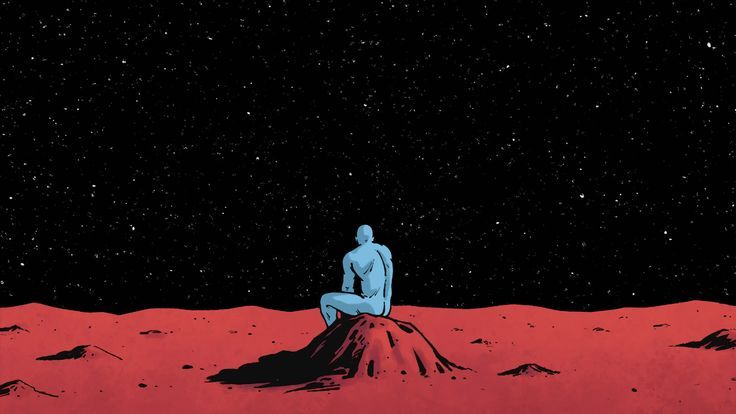

# Hi, I'm Mathan

  

## About Me

  passionate in AI/ML devlopment and  intrest in producation based soultion for real world problems.

  
  
  

 

## Languages And Tools

  

## GitHub Activity

  

## GitHub Contribution Calendar

  

  

Always learning. Always building.

